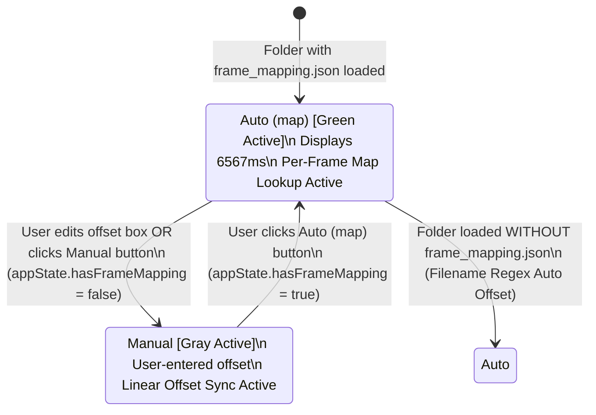

# Frame Mapping & Per-Frame Synchronization Architecture (`frame_mapping.json`)

This document details the architectural design, file schema, dynamic FPS detection, offset formulas, UI state machine, and edge-case safeguards for `frame_mapping.json` integration in the Visualizer.

---

## 1. Overview & Purpose

`frame_mapping.json` is a line-delimited JSON (JSONL) file produced by logging scripts (e.g. ARAS / AWR1843 radar loggers). It contains exact 1-to-1 temporal alignment records between radar frames and video frames.

When present in an uploaded folder, the visualizer automatically detects `frame_mapping.json`, measures the true video recording FPS, calculates the human-readable display offset, and bakes sub-millisecond per-frame alignment into the playback engine.

---

## 2. File Schema & Data Format

Each line in `frame_mapping.json` represents a single mapped frame object:

```json
{
  "radar_frame_id_rel": 1,
  "radar_frame_id_abs": 1279,
  "radar_timestamp": 1784092842.104461,
  "video_frame_index": 197,
  "video_frame_ts": 1784092842.047886,
  "video_time_delta": -0.05657505989074707
}
```

### Field Definitions:
- `radar_frame_id_rel`: 1-based relative radar frame index.
- `radar_frame_id_abs`: Absolute hardware radar frame index.
- `radar_timestamp`: Unix timestamp (in seconds) when the radar frame was captured.
- `video_frame_index`: Corresponding 0-based or 1-based video frame number.
- `video_frame_ts`: Unix timestamp (in seconds) of the matching video frame.
- `video_time_delta`: Micro-second precision time delta (`video_frame_ts - radar_timestamp`).

---

## 3. Dynamic Video FPS Recognition

Instead of assuming a static 30 FPS, the visualizer dynamically calculates the true hardware recording frame rate from `frame_mapping.json` records:

$$\text{Detected FPS} = \frac{\text{video\_frame\_index}[N] - \text{video\_frame\_index}[0]}{\text{video\_frame\_ts}[N] - \text{video\_frame\_ts}[0]}$$

- Automatically adapts to 24, 25, 29.97, 30, 50, 59.94, or 60 FPS.
- Stored in `appState.videoFps` and exposed globally via `getVideoFps()`.

---

## 4. Display Offset vs Per-Frame Sync Baking

### Human-Readable Display Offset (UI Input Box)
Users conceptualize the offset as **"by how many milliseconds does the video lead the radar?"**
When `frame_mapping.json` is loaded, the input box displays:

$$\text{Display Offset (ms)} = \frac{\text{video\_frame\_index}}{\text{getVideoFps()}} \times 1000$$

*(Example: 197 frames @ 30.0 FPS = **6567 ms**)*

### Per-Frame Sync Baking (`precomputeRadarVideoSync`)
While the offset input box shows `6567 ms`, actual video playback alignment is driven by the absolute timestamps in `frameMappingTable`:

$$\text{videoSyncedTime} = \text{video\_frame\_ts}[i] - \text{videoStartUnixSec}$$

This guarantees 100% sub-millisecond precision even if the video has variable frame rates or dropped frames.

---

## 5. Segmented Offset Mode Toggle & State Machine

Beside the offset input box, a **Segmented Toggle Switch** visually displays the active synchronization mode:

```
+--------------------------+
|  Auto (map)  |  Manual   |
+--------------------------+
  (Green Active) (Gray)
```

### State Machine Transitions:



- **Revert to Map**: Clicking `Auto (map)` restores `appState.hasFrameMapping = true`, re-bakes `precomputeRadarVideoSync()` from `frameMappingTable` in memory, deletes any manual offset override from IndexedDB, and updates `offsetInput.value` back to `6567 ms`.

---

## 6. Edge-Case Safeguards

### Deferred IndexedDB Cache Cleanup (Accidental Drop Protection)
- Dropping a new folder onto an active session pauses playback immediately, but **does NOT wipe IndexedDB or active state**.
- If the user cancels or closes the Case C selection modal without picking a pair, the active visualization session and IndexedDB cache remain **100% intact**.
- Previous cache entries are overwritten only after a new dataset load is confirmed by the user.

### Web Worker Cleanup
- When a new dataset pipeline is confirmed, any running JSON parsing Web Worker (`parser.worker.js`) is terminated (`appState.activeWorker.terminate()`) to prevent race conditions or background memory leaks.

---

## 7. Key File References

- [src/state.js](file:///d:/Work/Repo/refactor/steps/src/state.js): Stores `frameMappingTable`, `hasFrameMapping`, `frameMapFile`, `frameMapBaseOffset`, `videoFps`, and `activeWorker`.
- [src/load_folder.js](file:///d:/Work/Repo/refactor/steps/src/load_folder.js): Auto-detects `frame_mapping.json` and renders green modal banner.
- [src/fileLoader.js](file:///d:/Work/Repo/refactor/steps/src/fileLoader.js): Parses `frame_mapping.json`, detects dynamic FPS, calculates human-readable offset, and handles `revertToAutoOffset()`.
- [src/utils.js](file:///d:/Work/Repo/refactor/steps/src/utils.js): `precomputeRadarVideoSync()` bakes per-frame video timestamps.
- [src/sync.js](file:///d:/Work/Repo/refactor/steps/src/sync.js): `forceResyncWithOffset()` handles manual mode override and toggle updates.
- [index.html](file:///d:/Work/Repo/refactor/steps/index.html) & [src/dom.js](file:///d:/Work/Repo/refactor/steps/src/dom.js): Segmented mode toggle switch markup and `setOffsetToggleMode()` controller.
