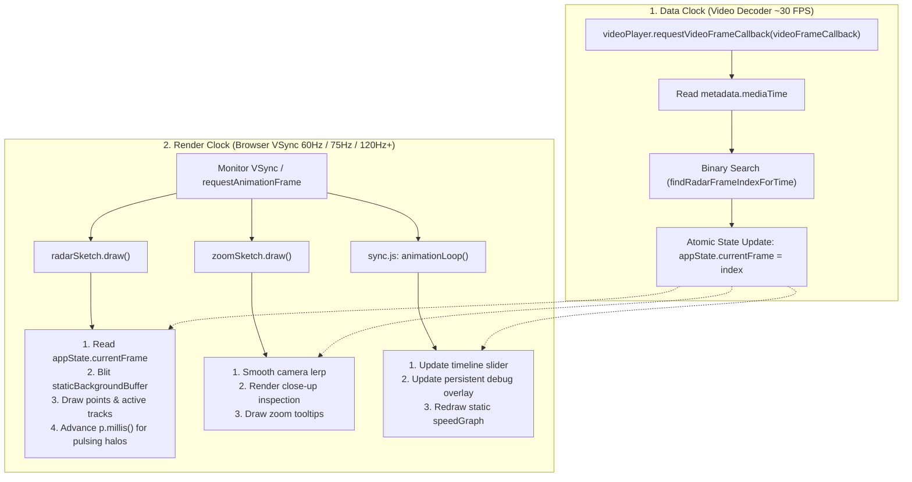

# Video/Radar Synchronization & Canvas Render Engine Architecture

This document details the architectural design, timing models, state management, render pipelines, and performance safeguards for the radar visualizer's synchronization engine. It serves as a permanent technical reference for maintenance and troubleshooting.

---

## 1. Executive Summary & Core Philosophy

The visualizer synchronizes two fundamentally different data sources:
1. **Radar Frame Stream**: Sampled at discrete sensor intervals ($\approx 10\text{Hz}$ to $30\text{Hz}$ with variable $\Delta t$).
2. **Video Stream**: Decoded at standard camera frame rates (typically $30\text{FPS}$ or variable).
3. **Display Output**: Rendered at the client monitor's physical refresh rate ($60\text{Hz}$, $75\text{Hz}$, $120\text{Hz}$, $144\text{Hz}$, etc.).

To prevent race conditions, frame tearing, and UI freezing, the architecture strictly separates **Data Synchronization** from **Screen Rendering** using a **Two-Clock Decoupled Pipeline**.

---

## 2. Two-Clock Decoupled Synchronization Engine



### Tier 1: The Data Clock (`videoFrameCallback`)
- **Location**: [`steps/src/sync.js`](file:///d:/Work/Repo/refactor/steps/src/sync.js)
- **Mechanism**: Utilizes `videoPlayer.requestVideoFrameCallback(videoFrameCallback)`.
- **Purpose**: Runs strictly on the video decoder's clock.
- **Rule**: Performs **ZERO drawing**, **NO DOM manipulation**, and **NO heavy math**. Its sole responsibility is:
  $$\text{mediaTime} \xrightarrow{\text{O(1) search}} \text{appState.currentFrame}$$

### Tier 2: The Render Clock (`p5.loop()` & `animationLoop`)
- **Location**: [`steps/src/p5/radarSketch.js`](file:///d:/Work/Repo/refactor/steps/src/p5/radarSketch.js), [`steps/src/p5/zoomSketch.js`](file:///d:/Work/Repo/refactor/steps/src/p5/zoomSketch.js), [`steps/src/sync.js`](file:///d:/Work/Repo/refactor/steps/src/sync.js)
- **Mechanism**: Native browser `requestAnimationFrame` driven by the display hardware VSync.
- **Purpose**: Reads `appState.currentFrame` at the screen's native refresh rate to calculate continuous micro-animations (pulsing warning halos, camera lerping, hover reticles).

---

## 3. The `noLoop()` vs `p.loop()` Evolution & The Paused Animation Fix

### The Historical Problem with `p.noLoop()`
Historically, `radarSketch` was configured with `p.noLoop()` in `setup()` to conserve CPU cycles when playback was paused. `draw()` was only invoked on explicit frame changes via `p.redraw()`.

**The Failure Mode**:
- Time-based visual effects (e.g., FCW warning halos using `pulse = (p.millis() / 5) % 25 + 10`) froze completely when playback was paused or when stepping frame-by-frame.
- When users opened "Close-Up Display" / God Mode, `ui.js` called `appState.p5_instance.loop()`, which inadvertently unlocked continuous rendering—creating the false impression that God Mode was required for pulsing halos.

### The Modern Solution: Native Continuous Loop with Buffer Caching
1. `radarSketch` and `zoomSketch` both run with `p.loop()` enabled.
2. **Buffer Caching Safeguard**: Heavy static geometry (distance circles, angle rays, Cartesian grid, ego vehicle) is pre-rendered once into an off-screen buffer ([`staticBackgroundBuffer`](file:///d:/Work/Repo/refactor/steps/src/p5/radarSketch.js#L46)).
3. **Execution Cost**: On each VSync tick, `p.draw()` merely blits `staticBackgroundBuffer` and iterates over ~20–40 radar points/tracks.
4. **Performance**: Total frame render time is $\le 0.3\text{ms}$, consuming $< 2.5\%$ of a 75 Hz (13.33ms) or 60 Hz (16.67ms) frame budget.
5. **Result**: Pulsing warning halos, glowing markers, and camera smoothing animate at a rock-solid 60–144 FPS with negligible CPU/GPU overhead whether playing or paused.

---

## 4. The "~150 FPS on 75 Hz Screen" Anomaly & Resolution

### Root Causes of the Anomaly:
1. **Artificial Target Frame Rate (`p.frameRate(144)`)**: In p5.js, setting `frameRate(144)` forces internal timer thresholds down to $\sim 6.9\text{ms}$, conflicting with native monitor VSync.
2. **Double Invocations per VSync Tick**: During playback, `animationLoop` in `sync.js` was calling `appState.p5_instance.redraw()` concurrently while p5's own native `loop()` was also ticking:
   $$\text{75 (p5 loop)} + \text{75 (sync.js manual redraw)} \approx 150\text{ draw calls/sec}$$
3. **Instantaneous Delta Jitter**: The FPS counter calculated $1000 / \Delta t$ on single frames using `p.millis()`. Two consecutive frames $6.7\text{ms}$ apart produced an instantaneous spike of $149.2\text{ FPS}$.
4. **Hardcoded 60 FPS Color Check**: `dom.js` checked `fps >= 58 && fps <= 62`, causing 75 Hz, 90 Hz, and 120 Hz screens to turn red.

### The Fixes Applied:
- **Set Target Frame Rate Ceiling (`p.frameRate(240)`)**: By default, p5.js caps frame rates to $60\text{ FPS}$ ($\approx 16.67\text{ms}$). On a $75\text{Hz}$ monitor ($13.33\text{ms}$ ticks), p5's internal timer evaluates `time_since_last >= 16.67 - 5 = 11.67ms` and skips every alternate tick, throttling rendering down to $37.5\text{ FPS}$ ($30\text{–}60\text{ FPS}$ stutter). Setting `p.frameRate(240)` sets the timer threshold to $4.16\text{ms} - 5\text{ms} \le 0\text{ms}$, allowing `requestAnimationFrame` to draw on **every single VSync tick** (75.0 FPS on 75Hz, 120.0 FPS on 120Hz, 144.0 FPS on 144Hz) with 0 dropped frames.
- **Eliminated Redundant `redraw()`**: Removed `appState.p5_instance.redraw()` from [`sync.js:animationLoop`](file:///d:/Work/Repo/refactor/steps/src/sync.js#L254), ensuring that p5 only paints once per native VSync tick.
- **Rolling 500ms Sample Accumulator**:
  ```javascript
  fpsFrameCount++;
  const now = performance.now();
  const elapsed = now - fpsLastCalcTime;
  if (elapsed >= 500) {
    const measuredFps = (fpsFrameCount * 1000) / elapsed;
    appState.fps = appState.fps === 0 ? measuredFps : (appState.fps * 0.7 + measuredFps * 0.3);
    fpsFrameCount = 0;
    fpsLastCalcTime = now;
  }
  ```
- **Universal Refresh Rate Thresholding in `dom.js`**:
  ```javascript
  let fpsColor = "#98FB98"; // Pale green for >= 45 FPS (60Hz, 75Hz, 120Hz+)
  if (fps < 30) {
    fpsColor = "#FF6347"; // Red for severe drops
  } else if (fps < 45) {
    fpsColor = "#FFD700"; // Yellow for minor drops
  }
  ```

---

## 5. Concurrency & State Safety Guarantees

| Variable / Action | Access Pattern | Concurrency Protection |
| :--- | :--- | :--- |
| **`appState.currentFrame`** | Written by `videoFrameCallback` / UI scrubbers; Read by `radarSketch`, `zoomSketch`, `speedGraph`. | Single-threaded JavaScript event loop guarantees atomic integer writes. No locks required. |
| **Video Seeking Debounce & Live Drift Sync** | Wheel scrubbing on canvas / timeline. | `handleTimelineWheel` updates `appState.currentFrame` immediately for 0ms visual lag; debounces `videoPlayer.currentTime` seek by 300ms. `radarSketch.draw()` and `handleVideoSeeked()` update `updatePersistentOverlays(videoPlayer.currentTime)` live on every VSync tick and upon seek completion, guaranteeing instantaneous, accurate drift readouts. |
| **P5 Graphics Buffers** | `staticBackgroundBuffer`, `trackLegendBuffer`. | Pre-rendered on canvas resize/initialization; read-only during draw loop. Zero memory allocations in render loop. |
| **Multi-Sketch Coordination** | Radar (active loop), Zoom (active loop), Speed Graph (on-demand `noLoop`). | Speed Graph only renders when `appState.currentFrame` changes or timeline scales, preventing idle GPU cycles. |

---

## 6. Engineering Rules & Anti-Patterns (Do NOT Break)

1. **DO NOT** add `p.frameRate(N)` where $N > 60$ in p5 setup unless specifically benchmarking off-screen. It breaks native VSync frame pacing.
2. **DO NOT** call `appState.p5_instance.redraw()` inside `requestAnimationFrame` while `p.loop()` is active. This causes double-rendering.
3. **DO NOT** perform DOM mutations or binary search calculations inside `radarSketch.draw()`. Keep `draw()` purely visual.
4. **DO NOT** reintroduce `p.noLoop()` to `radarSketch` unless you provide an alternative animation timer for time-based visual warnings.
5. **ALWAYS** use `performance.now()` for timing and FPS math rather than `p.millis()` or `Date.now()`.
